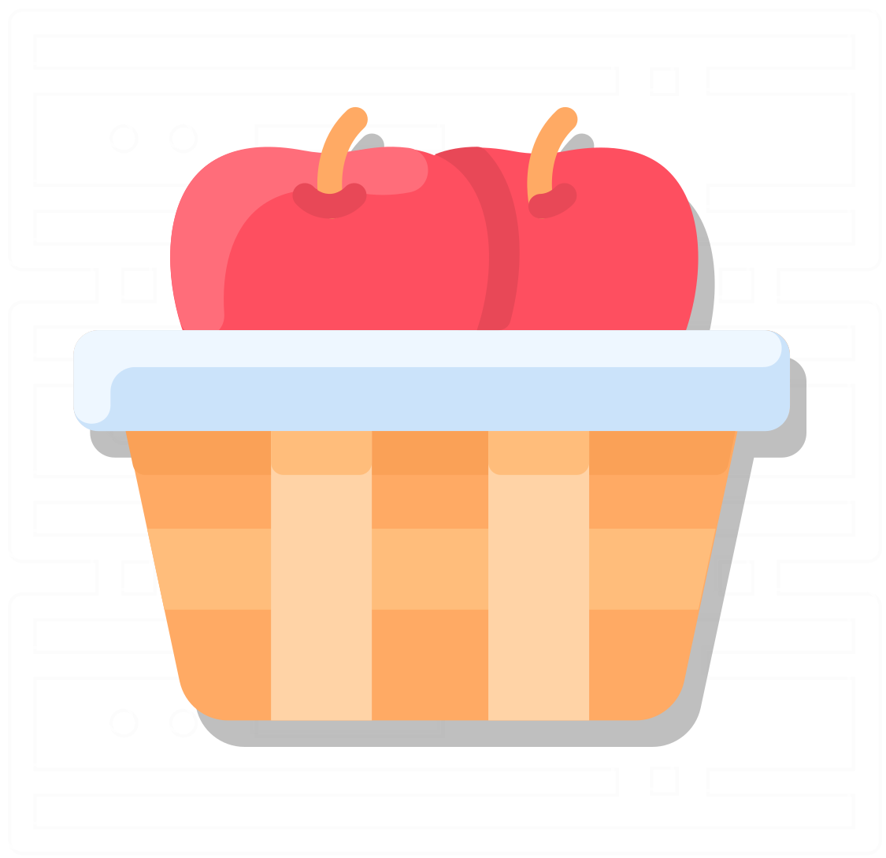

<p align="center">
    
</p>
<h1 align="center"> BushelKit </h1>

Open source components of [Bushel](https://getbushel.app) for developers.

[](https://docs.getbushel.app/docc)
[](https://swiftpackageindex.com/brightdigit/BushelKit)

[](https://c.im/@leogdion)
[](https://www.youtube.com/@brightdigit)
[](https://bsky.app/profile/leogdion.bsky.social)

[-@brightdigit-whitesmoke.svg?style=for-the-badge&logo=x)](http://twitter.com/brightdigit)
[-@leogdion-whitesmoke.svg?style=for-the-badge&logo=x)](http://twitter.com/leogdion)

<!--


[](https://swiftpackageindex.com/brightdigit/BushelKit)
[](https://swiftpackageindex.com/brightdigit/BushelKit)


[](https://codecov.io/gh/brightdigit/BushelKit)
[](https://www.codefactor.io/repository/github/brightdigit/BushelKit)
-->
[](https://codeclimate.com/repos/675322f20ee99b00b9c28232/maintainability)
<!--
[](https://codebeat.co/projects/github-com-brightdigit-BushelKit-main)
-->


# Table of Contents

* [Introduction](#introduction)
* [Usage](#usage)
* [Roadmap](#roadmap)
* [Documentation](#documentation)
* [License](#license)

<!-- Created by https://github.com/ekalinin/github-markdown-toc -->

# Introduction

This is an open-source component for [Bushel, a macOS virtual machine app](https://getbushel.app) for developers. This will utilitized in the future for build open-source apps such as a command line app and more.

## Requirements 

**Apple Platforms**

- Xcode 16.0 or later
- Swift 6.0 or later
- iOS 17 / watchOS 10.0 / tvOS 17 / macOS 14 or later deployment targets

**Linux**

- Ubuntu 20.04 or later
- Swift 6.0 or later

# Usage

If you'd like to use BushelKit, add [the products](https://docs.getbushel.app/docc) you'd like to use in your app.

```swift
let package = Package(
  ...
  dependencies: [
    .package(url: "https://github.com/brightdigit/BushelKit.git", from: "2.0.0")
  ],
  targets: [
      .target(
          name: "YourApp",
          dependencies: [
            .product(name: "BushelLibrary", package: "BushelKit"),
            .product(name: "BushelMachine", package: "BushelKit"),
            ...
      ]),
  ]
)
```

# Roadmap

This library is still under construction. Here are the plans for the future.

## v2.1 
* [#10 (docs) - Finish Documentation for bushel CLI](https://github.com/brightdigit/BushelDocs/issues/10)

## 2.2
* [#48 - bushel CLI v.x](https://github.com/brightdigit/BushelKit/issues/48)
* [#47 - Add Tutorials for Creating a Machine](https://github.com/brightdigit/BushelKit/issues/48) / _[#11 - docs](https://github.com/brightdigit/BushelDocs/issues/11)_
* [#34 - Finish Documentation for BushelMachine DocC](https://github.com/brightdigit/BushelKit/issues/34)       

## 2.3          
* [#47 - Add Tutorial for Creating a Library](https://github.com/brightdigit/BushelKit/issues/47) / _[#12 docs](https://github.com/brightdigit/BushelDocs/issues/12)_
* [#45 - Add Tutorial for Importing/Downloading an Image Into a Library](https://github.com/brightdigit/BushelKit/issues/45) / _[#13 docs](https://github.com/brightdigit/BushelDocs/issues/13)_         
* [#30 - Finish Documentation for BushelLibrary DocC](https://github.com/brightdigit/BushelKit/issues/30)     

## 2.4        
* [#38 - Finish Documentation for BushelUtilities DocC](https://github.com/brightdigit/BushelKit/issues/38)           
* [#27 - Finish Documentation for BushelHub DocC](https://github.com/brightdigit/BushelKit/issues/27)          
* [#43 - Add Tutorial for Creating A Machine From A Snapshot](https://github.com/brightdigit/BushelKit/issues/43) / _[#15 docs](https://github.com/brightdigit/BushelDocs/issues/15)_
* [#41 - Add Tutorial for Verifying An Image](https://github.com/brightdigit/BushelKit/issues/41) / _[#17 docs](https://github.com/brightdigit/BushelDocs/issues/17)_
      
## 2.5      
* [#24 - Finish Documentation for BushelFoundation DocC](https://github.com/brightdigit/BushelKit/issues/24)           
* [#23 - Finish Documentation for BushelFactory DocC](https://github.com/brightdigit/BushelKit/issues/23)   
* [#42 - Add Tutorial for Booting Up Machine](https://github.com/brightdigit/BushelKit/issues/42) / _[#16 docs](https://github.com/brightdigit/BushelDocs/issues/16)_
* [#18 (docs) - Finish Documentation for Bushel REST API](https://github.com/brightdigit/BushelDocs/issues/18)
* [#44 - Add Tutorial for Creating A Snapshot](https://github.com/brightdigit/BushelKit/issues/44) / _[#14 docs](https://github.com/brightdigit/BushelDocs/issues/14)_

## Future Release
* [#40 - Finish Documentation for bushel DocC](https://github.com/brightdigit/BushelKit/issues/40)                            
* [#37 - Finish Documentation for BushelUT DocC](https://github.com/brightdigit/BushelKit/issues/37)                     
* [#36 - Finish Documentation for BushelTestUtilities DocC](https://github.com/brightdigit/BushelKit/issues/36)          
* [#35 - Finish Documentation for BushelMachineWax DocC](https://github.com/brightdigit/BushelKit/issues/35)             
* [#33 - Finish Documentation for BushelMacOSCore DocC](https://github.com/brightdigit/BushelKit/issues/33)              
* [#32 - Finish Documentation for BushelLogging DocC](https://github.com/brightdigit/BushelKit/issues/32)                
* [#31 - Finish Documentation for BushelLibraryWax DocC](https://github.com/brightdigit/BushelKit/issues/31)             
* [#29 - Finish Documentation for BushelHubMacOS DocC](https://github.com/brightdigit/BushelKit/issues/29)               
* [#28 - Finish Documentation for BushelHubIPSW DocC](https://github.com/brightdigit/BushelKit/issues/28)                 
* [#26 - Finish Documentation for BushelGuestProfile DocC](https://github.com/brightdigit/BushelKit/issues/26)           
* [#25 - Finish Documentation for BushelFoundationWax DocC](https://github.com/brightdigit/BushelKit/issues/25)              
* [#22 - Finish Documentation for BushelDocs DocC](https://github.com/brightdigit/BushelKit/issues/22)                   
* [#21 - Finish Documentation for BushelArgs DocC](https://github.com/brightdigit/BushelKit/issues/21) 

# Documentation

To learn more, check out the full [documentation](https://docs.getbushel.app/docc).

# License 

This code is distributed under the MIT license. See the [LICENSE](https://github.com/brightdigit/BushelKit/blob/main/LICENSE) file for more info.
